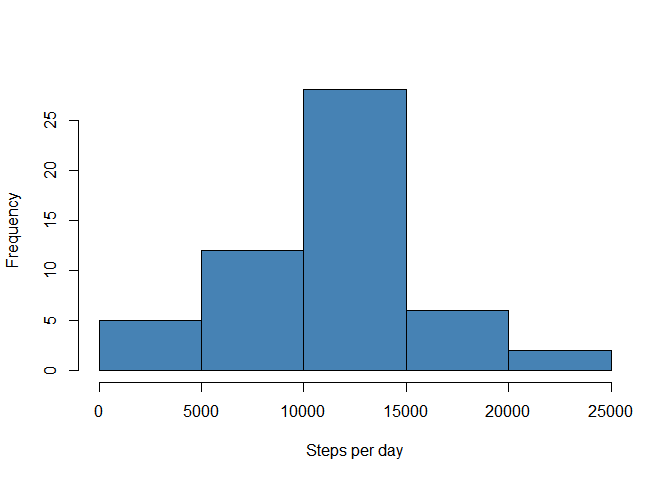
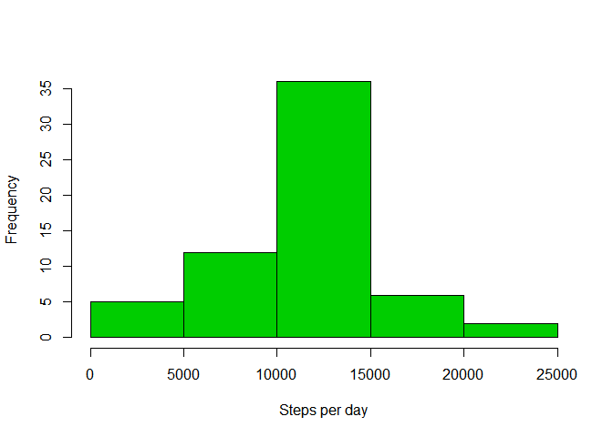
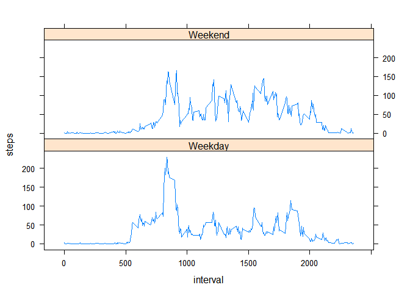

# Reproducible Research: Peer Assessment 1

setwd("C:/R working directory/RepData/RepData_PeerAssessment1")


## Loading and preprocessing the data

First let's set the locale to English:


```r
Sys.setlocale("LC_TIME", "English")
```

```
## [1] "English_United States.1252"
```

Then let's load the data:


```r
activity <- read.csv("activity.csv", colClasses = c("numeric", "Date"))
```

I like to use the dplyr package to manipulate data:


```r
library(dplyr)
```

```
## 
## Attaching package: 'dplyr'
## 
## The following object is masked from 'package:stats':
## 
##     filter
## 
## The following objects are masked from 'package:base':
## 
##     intersect, setdiff, setequal, union
```

Let's add a column indicating the hour of the day when the steps were made:


```r
activity <- mutate(activity, hour=trunc(interval/100))
```

Let's add a column indicating the weekday when the steps were made:


```r
activity <- mutate(activity, weekday=weekdays(date))
```

Now we have all the info we need to answer the following questions


```r
head(activity)
```

```
##   steps       date interval hour weekday
## 1    NA 2012-10-01        0    0  Monday
## 2    NA 2012-10-01        5    0  Monday
## 3    NA 2012-10-01       10    0  Monday
## 4    NA 2012-10-01       15    0  Monday
## 5    NA 2012-10-01       20    0  Monday
## 6    NA 2012-10-01       25    0  Monday
```


## What is mean total number of steps taken per day?

####1. Calculate the total number of steps taken per day

Let's calculate a dataframe of the total amount of steps by day


```r
stepsperday <- group_by(activity[ , 1:2], date)
stepsperday <- summarise(stepsperday, steps = sum(steps))
print.data.frame(head(stepsperday))
```

```
##         date steps
## 1 2012-10-01    NA
## 2 2012-10-02   126
## 3 2012-10-03 11352
## 4 2012-10-04 12116
## 5 2012-10-05 13294
## 6 2012-10-06 15420
```


####2.  Make a histogram of the total number of steps taken each day


```r
hist(stepsperday$steps, main = "", col="steelblue", xlab = "Steps per day")
```

 

#### 3. Calculate and report the mean and median of the total number of steps taken per day


The mean amount of steps taken per day is 10766 and the median is 10765


## What is the average daily activity pattern?


#### 1.Make a time series plot (i.e. type = "l") of the 5-minute interval (x-axis) and the average number of steps taken, averaged across all days (y-axis)

Let's calculate a data frame with average steps per minute:


```r
avgstepsperinterval <- activity[ !(is.na(activity$steps)) ,]
avgstepsperinterval <- group_by(avgstepsperinterval[ , c(1,3)], interval)
avgstepsperinterval <- summarise(avgstepsperinterval, steps = mean(steps))
print.data.frame(head(avgstepsperinterval))
```

```
##   interval steps
## 1        0     2
## 2        5     0
## 3       10     0
## 4       15     0
## 5       20     0
## 6       25     2
```

So let's print the time series plot:


```r
with(avgstepsperinterval,plot(interval, steps, type="l"))
```

 

#### 2.Which 5-minute interval, on average across all the days in the dataset, contains the maximum number of steps?

This can be calculated with the following code:


```r
avgstepsperinterval[avgstepsperinterval$steps==max(avgstepsperinterval$steps), ]
```

```
## Source: local data frame [1 x 2]
## 
##   interval steps
## 1      835   206
```


## Imputing missing values

####1. Calculate and report the total number of missing values in the dataset (i.e. the total number of rows with NAs)

This can be done with the following


```r
nrow(activity[!complete.cases(activity), ])
```

```
## [1] 2304
```

#### 2.Devise a strategy for filling in all of the missing values in the dataset. The strategy does not need to be sophisticated. For example, you could use the mean/median for that day, or the mean for that 5-minute interval, etc.

Let's use the previously calculated avgstepsperinterval. Let's merge this with the activity data frame into activity2 and let's sort the observations to their original order:


```r
activity2 <- merge(activity, avgstepsperinterval, by="interval", all.x="true")
activity2 <- activity2[order(activity2$date),]
head(activity2)
```

```
##     interval steps.x       date hour weekday steps.y
## 1          0      NA 2012-10-01    0  Monday       2
## 63         5      NA 2012-10-01    0  Monday       0
## 128       10      NA 2012-10-01    0  Monday       0
## 205       15      NA 2012-10-01    0  Monday       0
## 264       20      NA 2012-10-01    0  Monday       0
## 327       25      NA 2012-10-01    0  Monday       2
```

Now let's add a new column where the NAs in steps are substituted with the avg values


```r
activity2 <-  mutate(activity2, steps=ifelse(is.na(steps.x),steps.y,steps.x))
```

#### 3. Create a new dataset that is equal to the original dataset but with the missing data filled in.


```r
activity2 <- activity2[ ,c(7,3,1,4,5) ]
```

#### 4. Make a histogram of the total number of steps taken each day and Calculate and report the mean and median total number of steps taken per day. Do these values differ from the estimates from the first part of the assignment? What is the impact of imputing missing data on the estimates of the total daily number of steps?

So as it was previously done:


```r
stepsperday2 <- group_by(activity2[ , 1:2], date)
stepsperday2 <- summarise(stepsperday2, steps = sum(steps))
print.data.frame(head(stepsperday2))
```

```
##         date steps
## 1 2012-10-01 10766
## 2 2012-10-02   126
## 3 2012-10-03 11352
## 4 2012-10-04 12116
## 5 2012-10-05 13294
## 6 2012-10-06 15420
```

```r
hist(stepsperday2$steps, main = "", col=555, xlab = "Steps per day")
```

 


So with the missing values the mean was 10766 and the median was 10765
Now with the missing values being replaced with the interval means the mean is 10766 and the median is 10766

Therefore substituting the missing values with interval means did not have any effect on the mean but it did have a slight effect on the median.

## Are there differences in activity patterns between weekdays and weekends?

#### 1.Create a new factor variable in the dataset with two levels - "weekday" and "weekend" indicating whether a given date is a weekday or weekend day.

So let's add the variable weekday2


```r
activity2 <- mutate(activity2, weekday2=ifelse(weekday=="Sunday" | weekday=="Saturday","Weekend","Weekday"))
head(activity2)
```

```
##   steps       date interval hour weekday weekday2
## 1     2 2012-10-01        0    0  Monday  Weekday
## 2     0 2012-10-01        5    0  Monday  Weekday
## 3     0 2012-10-01       10    0  Monday  Weekday
## 4     0 2012-10-01       15    0  Monday  Weekday
## 5     0 2012-10-01       20    0  Monday  Weekday
## 6     2 2012-10-01       25    0  Monday  Weekday
```

#### 2.Make a panel plot containing a time series plot (i.e. type = "l") of the 5-minute interval (x-axis) and the average number of steps taken, averaged across all weekday days or weekend days (y-axis). 

First we need to average the amount of steps by weekday/weekend and interval:


```r
activity2 <- group_by(activity2[ , c(1,3,6)], weekday2,interval)
activity2  <- summarise(activity2 , steps = mean(steps))
print.data.frame(head(activity2))
```

```
##   weekday2 interval steps
## 1  Weekday        0     2
## 2  Weekday        5     0
## 3  Weekday       10     0
## 4  Weekday       15     0
## 5  Weekday       20     0
## 6  Weekday       25     2
```

and then let's print the two plots using lattice:


```r
 library(lattice)
 with(activity2,xyplot(steps~interval|weekday2, type="l", layout = c(1, 2)))
```

 


So it can clearly be seen that there is difference in between weekend and weekday:
During weekdays there is more activity in the morning while during the weekend , steps are more uniformely distributed.


